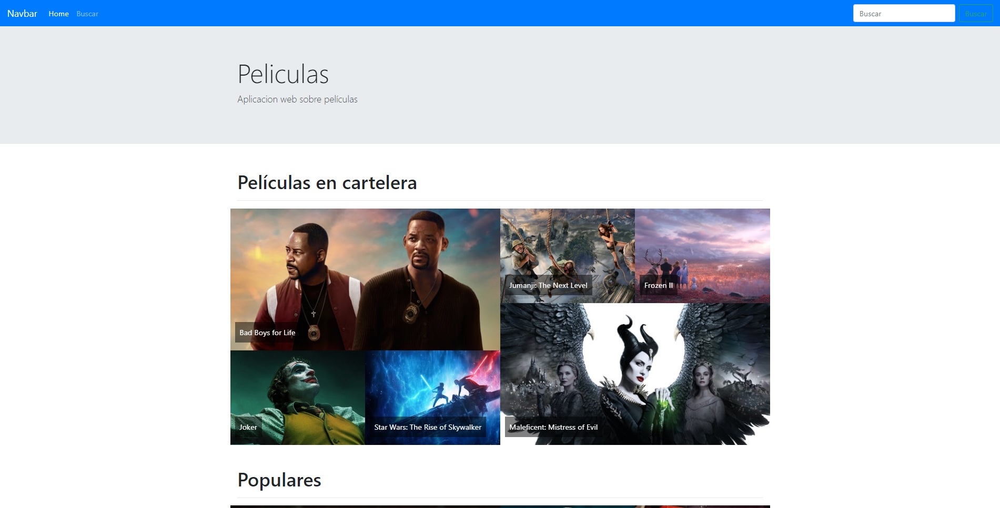
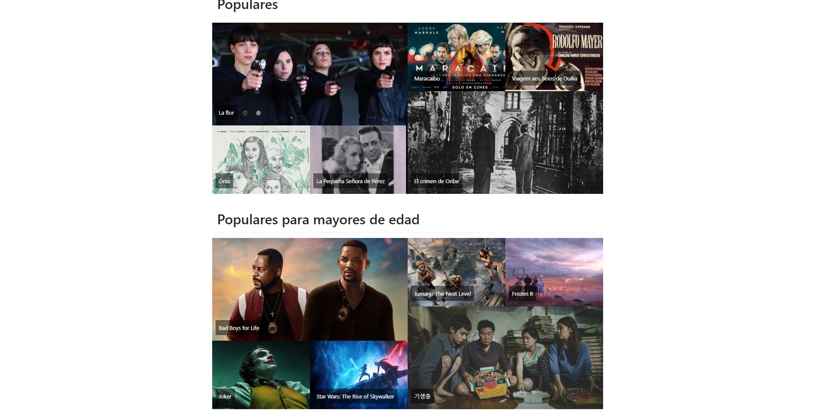
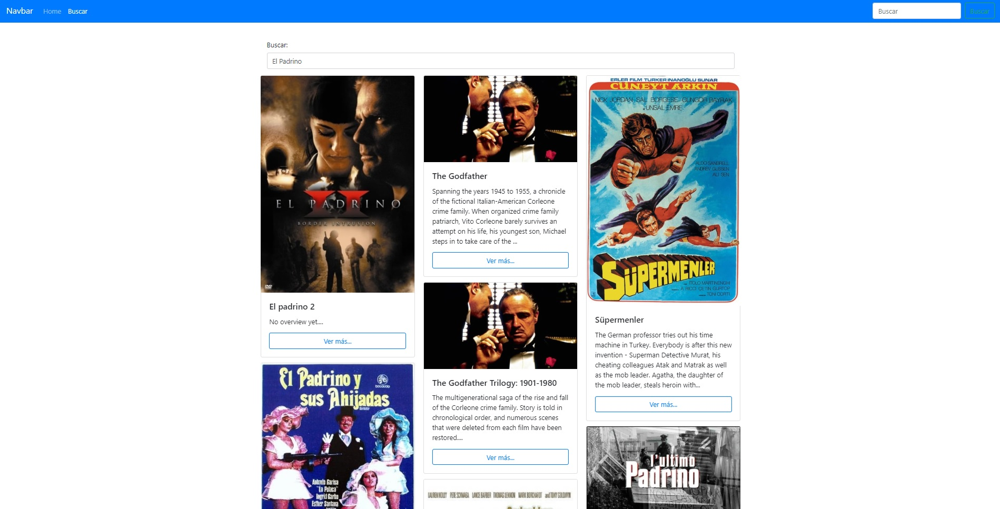
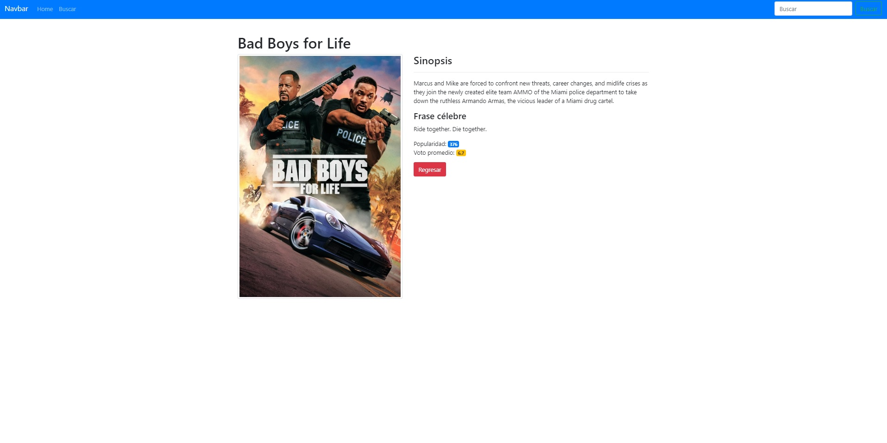

# PeliculasApp

Aplicación web al estilo IMDB.
Creado con HTML5, CSS3 y JavaScript mediante el uso de Angular.
Además utilizando la API que provee TheMovieDB.

## Vistas
### Index

### Búsqueda

### Peli
Se puede ingresar al tocar en el banner de una imagen, ya sea desde el index como desde una búsqueda.
En esta sección se encuentra el titulo de la película en cuestión, una breve descripción y valoración de la misma.

## Uso:
Despues de descargar el repositorio, a traves de la linea de comando ejecutar el siguiente script:

**npm install**

y luego:

**ng serve** 

o

**ng serve -o**
